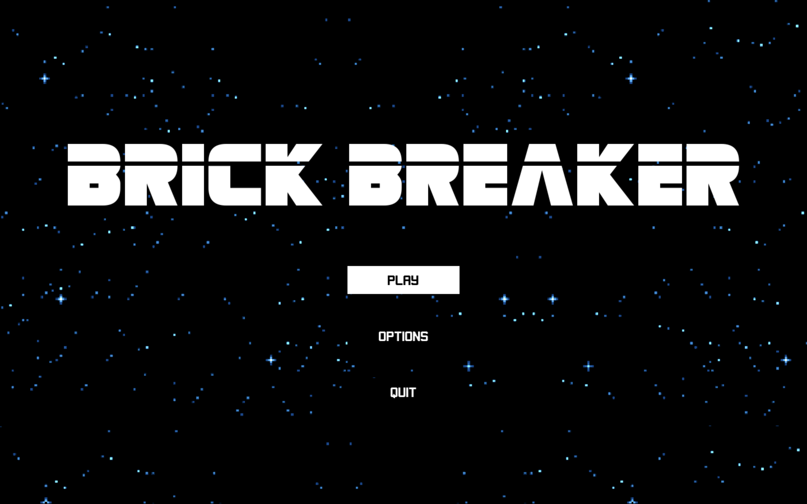

# Bricker Breaker

## Description
Brick breaker is a classic arcade game inspired by Atari's Breakout. The game's goal is to destroy all the bricks on the screen by repeatedly bouncing a ball off a paddle and into them.


## Gameplay

The player controls a paddle at the bottom of the screen using their mouse. At the start of the game, the player will have to serve the ball by clicking the left mouse button. The play can aim the ball by bouncing it off different paddle points. If the ball collides with the center of the paddle, it will rebound straight up. The closer to the edge of the paddle the ball touches, the more of an angle the ball will be deflected at. Bricks only take one hit to destroy. After destroying all the bricks on the screen, the player will progress to the next level.

### Power-ups

Upon destroying a brick, there is a chance it will drop a randomly generated power-up that will either help or hinder the player


</image> **Extra Life:** When collected, this power-up increases the player's lives by 1

</image> **Less Life:** When collected, this power-up decreases the player's lives by 1

</image>  **Speed Up:** When collected, this power-up increases the speed of the ball

</image>  **Slow Down:** When collected, this power-up decreases the speed of the ball

</image>  **New Ball:** When collected, this power-up adds another ball to the game.

## Menu

The main menu is the first screen that is displayed when the game is launched. It features buttons for starting a new game, accessing the options menu, and exiting the game. Players can navigate through the main menu using the mouse..

</image>

Additionally, the game features an in-game menu that can be accessed during gameplay by pressing <kbd>Esc</kbd>. This menu allows players to return to the main menu, resume the game, or access the options menu.

The options menu can be accessed from any screen within the game. It can be accessed from the main menu by simply clicking on the `OPTIONS` button. You can also access it in the playing state via the in-game menu.


## Requirements

- Python 3.9.13
- Pygame 2.1.2
- untangle

## Installation
Clone the repository.

```bash
git clone https://github.com/BradHillier/Brick-Breaker.git
```

Install the required libraries by running

```bash
pip3 install -r requirements.txt.
```

After installation is complete, the game can be played by running the following command in the root directory of the project

```bash
python3 src/main.py
```

## Credits

**Spritesheets Used**
    Breakout set - https://opengameart.org/content/breakout-set
    
**Images Used**
    Space background - https://wall.alphacoders.com/big.php?i=885542

**Music Used**
    Afterburner - https://opengameart.org/content/afterburner-music-track


